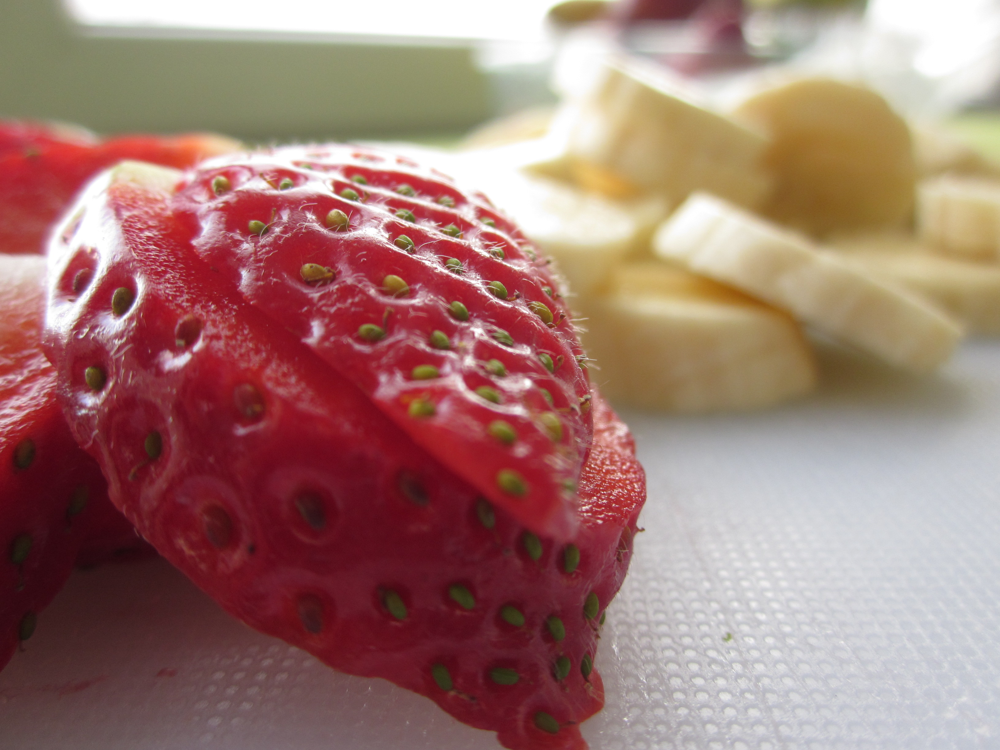
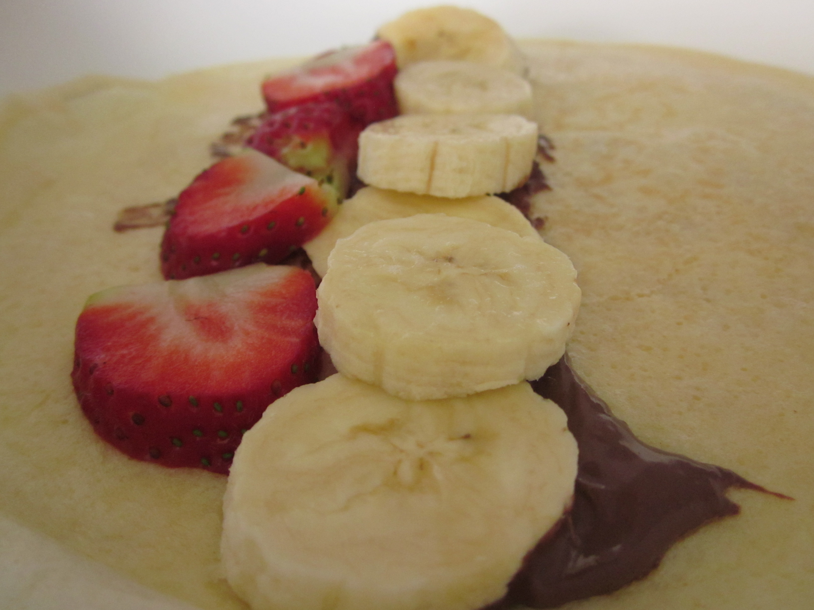
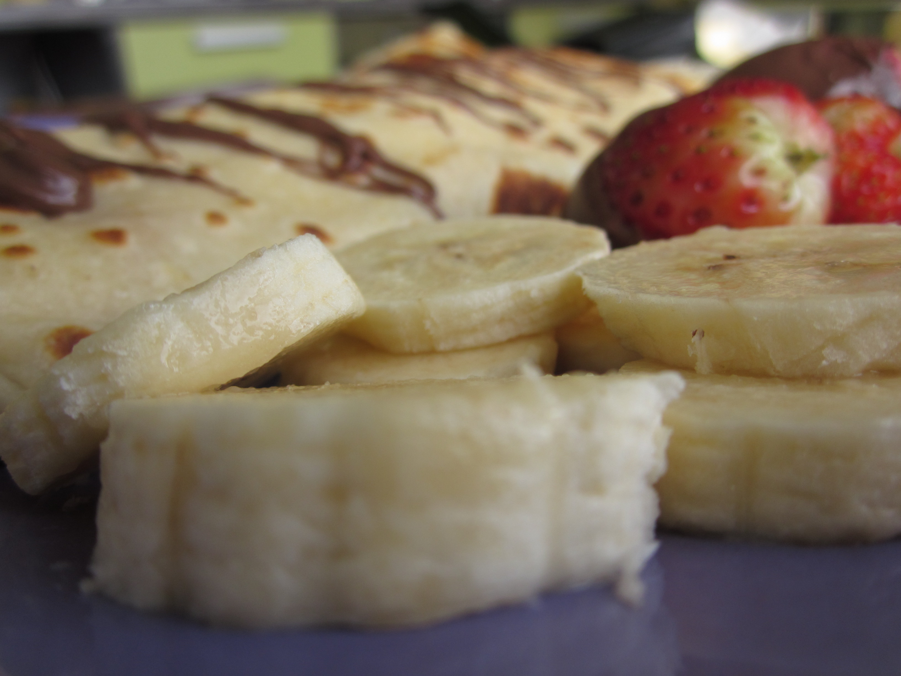

Разбийте яйцата и към тях добавете млякото, без да преставате да бъркате. Пресейте брашното и добавете към останалата смес.

Разбъркайте добре, докато сместа стане гладка и добавете зехтина, ванилията, солта и захарта. Загрейте силно тигана и го намажете леко с масло.

Изсипете от готовата смес, колкото да покрие добре дъното на съда.

Печете най-много 2-3 минути и после обърнете. Веднага след това добавете “линия” шоколад по средата на палачинката и отгоре наредете нарязаните банани и ягоди. Завийте палачинката и преместете в чиния. Повторете с останалата част от сместа.
  
Сервирайте по две палачинките топли и гарнирайте с нарязани банани и ягоди.